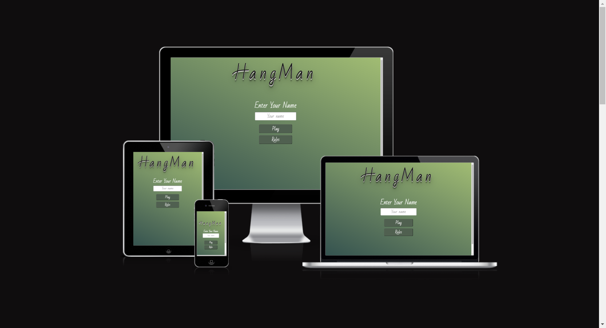

# **HangMan Game**

[HangMan Game](https://noeliaci.github.io/Hangman-Game/) is an online old school game where the goal is
 to find the missing word by guessing letters. The game has three different categories to choose from: Animals, Music Bands
 and Instruments. The player can guess a letter by clicking on it. The game finishes when the player has correctly guessed 
all the letters or when all six body parts are on the gallows.

---

## **Table of Contents**

- [**HangMan Game**](#hangman-game)
  - [**Table of Contents**](#table-of-contents)
  - [**Target Audience**](#target-audience)
  - [**User Stories**](#user-stories)
    - [**First Time User Goals**](#first-time-user-goals)
    - [**Returning User Goals**](#returning-user-goals)
    - [**Frequent User Goals**](#frequent-user-goals)
  - [**Design**](#design)
    - [**Color Theme**](#color-theme)
    - [**Font**](#font)
  - [**Wireframes**](#wireframes)
    - [**Desktop**](#desktop)
    - [**Tablet**](#tablet)
    - [**Mobile**](#mobile)
  - [**Features**](#features)
    - [**Header**](#header)
    - [**Footer**](#footer)
    - [**Home Screen**](#home-screen)
    - [**Categories Screen**](#categories-screen)
    - [**Game Screen**](#game-screen)
    - [**Result Screen**](#result-screen)
    - [**Rules Screen**](#rules-screen)
    - [**Features Left to Implement**](#features-left-to-implement)
  - [**Technologies Used**](#technologies-used)
  - [**Testing**](#testing)
  - [**Browser Testing**](#browser-testing)
  - [**Responsiveness**](#responsiveness)
  - [**Validators**](#validators)
  - [**Lighthouse**](#lighthouse)
  - [**Bugs**](#bugs)
    - [**Solved**](#solved)
    - [**Unsolved**](#unsolved)
  - [**Deployment**](#deployment)
  - [**Credits**](#credits)
    - [**Content**](#content)
    - [**Media**](#media)
  
## **Target Audience**

- Users who look for interactive online games.
- Users who want to challenge their language knowdlege.
- Users who enjoy playing word games.

## **User Stories**

### **First Time User Goals**

- As a first time user, I want to understand the purpose of the website, so I can learn about what is offered.
- As a first time user, I want to find rules or instructions sections, so I can understand the objective of the game.
- As a first time user, I want to easily navigate through the website, so I can quickly go from one section to another.

### **Returning User Goals**

- As a returning user, I want the game to have different categories, so I can test my skills in different areas.
- As a returning user, I want to be able to enter my user name, so I can have a personalised experience.
- As a returning user, I want the website to have social media links, so I can share my experience playing the game.

### **Frequent User Goals**

- As a frequent user, I want the game to be responsive, so I can play it on different devices.
  
## **Design**

### **Color Theme**

- The colour theme used for this project is a gradient bakground in green tones.

### **Font**

- The font used is Bad Script. This font resembles the handwritting which make it adequate for a words game.

## **Wireframes**

### **Desktop**

### **Tablet**

### **Mobile**

## **Features**

### **Header**

- The header is the title of the game which is centered and emphasized with a text shadow.
- It displays in every screen and when clicked, it takes the user back to the home screen.

### **Footer**

- The footer contains links for GitHub, LinkedIn and Instagram and the name of the author.

### **Home Screen**

- The home screen contains two buttons:
  - Play - takes the user to the category screen.
  - Rules - takes the user to the rules screen.
  - Both buttons play a sound effect when clicked.
- The home screen also contains a name form that, when filled, personalizes the result message.

### **Categories Screen**

- The categories screen displays three category buttons:
  - Animals
  - Music Bands
  - Instruments
- When one category is selected the button turns a different colour and the two other buttons can not be clicked.
- This screen also displays the canvas where the hangman will be draw.

### **Game Screen**

- The game screen displays the selected category button in a different colour and the two other category buttons disabled.
- It contains the keyboard where the user can click on the letters to guess the word.
- The character buttons disable once they are clicked and the letters replace the dashes in the word to guess.
- The canvas area displays a body part of the hangman every time an incorrect letter is clicked.
- The game ends when all the correct letters are displayed in the word area or when all the body parts of the hangman are displayed.
  

  
### **Result Screen**

- The result screen appears when the game is over.
- It displays  a different message depending on the result of the game.
- It also displays the correct word and the player name in both messages.
- It contais two buttons:
  - New Game - leads to the category screen to start a new game.
  - Home - leads to the home screen.

  

### **Rules Screen**

- The rules screen displays when the rules button in the home screen is clicked.
- It contains the instructions to play the game.
- It contains a home button that takes the user back to the home screen when clicked.

### **Features Left to Implement**

- Score tracking and leaderboard in order to keep the user engaged.
- 404 error page.

## **Technologies Used**

- [HTML](https://en.wikipedia.org/wiki/HTML)
- [CSS](https://en.wikipedia.org/wiki/CSS)
- [JavaScript](https://en.wikipedia.org/wiki/JavaScript)
- [GitHub](https://github.com/)
- [Codeanywhere](https://app.codeanywhere.com/)

## **Testing**

- I tested that this web page works in different browsers: Chrome, Firefox, Edge.
- I used devtools device toolbar to confirm that the website is responsive and looks good on all standard screen sizes.
- I tested all the links and confirmed that they work and lead where they should.
- I tested entering a name and checked that it is showing on the result screen.
- I tested the game playing in the different categories to make sure that everything works as it should.

## **Browser Testing**

- Chrome

- Edge

- Firefox

## **Responsiveness**

- Home Screen

- Rules Screen

- Categories Screen

- Game Screen

- Result Screen

## **Validators**

## **Lighthouse**

## **Bugs**

### **Solved**

### **Unsolved**

## **Deployment**

## **Credits**

### **Content**

### **Media**

